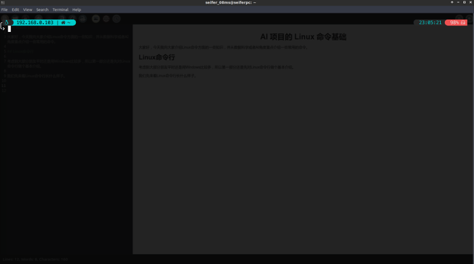

# AI 项目的 Linux 命令基础 (上篇)

大家好，今天我向大家介绍Linux命令方面的一些知识，并从数据科学或者AI角度重点介绍一些常用的命令。因为这块内容比较多，因此Linux命令基础分为上下两篇进行介绍，本文是其中的上篇。

## Linux命令行

### Linux命令行长什么样

考虑到大部分朋友平时还是用Windows比较多，所以第一部分还是先对Linux命令行做个基本介绍。

我们先来看Linux命令行长什么样子。在下面的截图中，我们可以看见的黑色窗口是**命令行的终端**（Terminal），闪动的光标前面是起始符，表示当前的命令行环境。


> 我这里使用的命令行环境是Oh-My-Zsh，并且通过一系列配置，显示了当前活动网络的IP地址，当前目录，操作系统，甚至当前时间和磁盘剩余空间,以及上一条命令的执行时间，省了我很多敲命令查看的时间。这里没有用比较常见的bash那种枯燥的`$`举例，也是想告诉大家，每个人的Linux可以是完全不同的样子，也希望通过后续的介绍，大家都可以根据自己需求配置出最有效率的Linux环境。

在这个终端窗口中，我们可以进行下面两种操作方式：
- 敲入**单个**命令，与终端进行**交互式**对话。 
- 执行一个**脚本**，**批量执行**一系列命令。

> 终端是负责用户与Linux命令行程序交互的界面。而Linux命令行实际的程序就是shell程序。我们能接触到的最常见的shell程序就是**bash**。

Linux下的命令有几个小技巧值的掌握：
- 通过上下箭头，可以重复历史命令
- 打出前几个字母后，再按`TAB`键可以快速补全命令

### Linux下的脚本集成

大部分用过Python或Matlab的朋友可以发现，Linux终端窗口的这种使用方式与我们常用的这些软件非常类似。那为什么有了Python等软件，我们还需要多掌握一个Linux命令行？我暂时能想到的部分原因有：
- 命令行有许多功能是开箱即用，不需要我们额外开发
- 命令行可配置，可扩展。自己配置熟练后，使用起来高效便捷
- 命令行下的shell命令或shell编程也可视作一种胶水语言，我们可以通过Linux命令行环境无缝**集成**Python、R甚至Octave等脚本程序。
> Octave可能是Matlab开源替代中最好的方案。吴恩达在机器学习课程中，就推荐过开源免费的Octave

我专门说下最后一个方面——脚本的集成。在安装好Python、R等计算环境后，我们就可以在Linux命令行环境使用这些`python`、`Rscript`新命令来执行Python或R脚本，我们可以在一个跑模型的脚本里，分别调用不同语言实现的逻辑，例如下面一个脚本示例：
```
#!/bin/bash
#  raw data downloading
wget http://xxxxurl.tar.gz
# data processing
python data.py
# model training
Rscript model.R
……
```
在上面的例子中，我们通过一个简单的脚本就分别调用了Linux的命令、Python和R下面的功能，分别实现一个非常雏形的模型pipeline。

### `shebang`符号

可能部分朋友对上述第一行的`#！/bin/bash`不熟悉，`#`是Linux命令行中的**注释**，指明其后的本行内容不执行。注释后面又跟了特殊的感叹号，表示后面不是一般的注释信息，而是类似脚本文件头的特殊信息。更详细的说，`#!`叫做`shebang`符号，**为shell环境指明当前脚本要执行的默认解释器**，如果**外部显示指明解释器，则该行不起作用**。例如这里的`/bin/bash`，就是最常见的shell环境bash的解释命令。

>Linux 中国翻译组为`#!`取了中文名叫释伴，意为解释伴随行，又为`shebang`的音译，非常巧妙

特别注意在Linux下，Python、R或Octave等脚本都可以使用`shebang`和增加执行权限的操作，变成可以在Linux下直接运行的脚本。例如，我们可以在每个py文件前，加入`#!/usr/bin/env python3`。这时，`shebang`为shell环境提供隐式的python解释器。
> 这里的**`#!/usr/bin/env python3`表示通过环境变量$PATH去寻找python3，比直接写的`#!/usr/bin/python3`灵活**。因为Python的版本很多，Python2和Python3还存在不兼容问题，我们经常需要通过切换环境变量，或者直接切换虚拟环境更改Python解释器去执行不同的代码。上面的写法可以自动通过环境变量找到所需要的实际Python位置，简单来说就和自己敲`python`执行的是同一个Python解释器；而如果写成`#!/usr/bin/python3`，则会直接去执行该路径的解释器命令，即使我们可以手动就改成每个实际需要的路径，也很麻烦，而且很容易出错。


此时，前面的脚本示例可以改成下面的形式：
```
#!/bin/bash
#  raw data downloading
wget http://xxxxurl.tar.gz
# data processing
./data.py
# model training
./model.R
……
```
通过上面的一个小改动，所有外部程序写的脚本都能以一种更加无缝的方式集成到统一的pipeline中。这也解释了前面一期说的，为什么Octave要把Maltlab的注释专门改为`#`。

## Linux命令基本使用方法

Linux命令的基本使用方法是`命令 [参数1 [参数2 ……]]`，这里的`命令`就是表示具体要执行的命令名字（例如`ls`，`whoami`等），`[参数1]`表示后面可能出现的参数，具体的参数个数要看命令的功能。命令可以不需要参数，也可能需要一个或多个参数，具体可以利用`man 命令`或`命令 --help`(部分命令的帮助需要执行`命令 -h`)查看。由于篇幅限制，专栏不会列出每个命令的每种用法，主要从数据科学或AI从业人员看待常用命令和用法的角度来介绍这些命令，大家在今后的学习中可以自己去查阅其他的用法，也可以在交流群里随时交流。
> 很多新出现的Linux命令，其实都是开源作者用Python等语言实现的小程序。我们在了解Linux命令常见的形式后，可以借助Python中的`argparse`等类似功能去开发自己的命令。

## Linux的几个知识点

从Windows切换到Linux，最容易有所不适的两个方面就是权限和编码。Linux中有着完善清晰的权限体系，比如我们想要直接执行脚本，就需要增加脚本文件的执行权限。同时，不同用户对不同文件的读写权限是分开管理，而Linux下的一切皆文件，所以我们几乎可以用命令控制和改变Linux 的所有。

### 权限与用户

Linux的文件权限类型包括读、写和执行，分别对应r、w和x。这些权限基于用户组分别设置，每个文件需要明确，文件所有者，用户群组和其他组三类用户的各自权限

#### 更改文件权限

- 更改文件权限的命令是`chmod`，一般常用场景是，写完一个脚本的文本文件`doit.sh` ，默认是权限位是`-rw-r--r--`，其中第一位为d时表示目录，否则为文件。其余分别表示文件所有人（创建文件的用户）可读写，不可执行；用户所在群组的其他用户和其他用户群组只能读。为能直接运行脚本，需要执行`chmod  +x doit.sh`，则文件的权限位变成`-rwxr-xr-x`, 说明`chmod`为这三个权限位全部加上了可执行权限。
> 我们可以用一种可能更常见的权限数字写法，例如`chmod 755 doit.sh`,会得到同样效果。这种写法的数字 4 、2 和 1 表示读、写、执行权限，两种以上权限可以通过加法组合表示，即 rwx = 4 + 2 + 1 = 7 ；rx = 4 +1 = 5 。如果我们知道16进制就很容易理解。

还有一种情况，我们还需要更改文件所有者才能进行操作，命令是`chown 用户名:用户组  路径`, 一般假设当前用户是`user1`，默认用户组也是`user1`，就可以用`chown user1:user1 -R path`。

#### root权限

经常玩手机的朋友会知道手机有root权限的说法。安卓系统源于Linux，自然Linux里就有一样的root权限的设定。比如我们在使用一些命令时，系统经常不允许当前用户来更改，我们需要用root权限来强行完成这个目的，做法有以下两种：
- 使用`sudo su`, 然后输入当前用户密码切换到root中，你就可以不受约束，做任何事情；执行完操作后，`exit`退出`root`账户
- 使用`sudo` 执行命令，临时提权为root权限。比如更改一些文件所有者时，往往需要`sudo chown ....`，这时也会提示输入当前密码继续执行。

> 🙋‍♂️这里可以留一个问题，你认为上述两种的方式中，那一种更好呢？理由是什么？

对了，差点忘记要**特别提示一点**：**切换到root后**，**做一切改动请三思而后行**！**请三思而后行**！**请三思而后行**！重要的事情说三遍！！！

### 编码与换行

从Windows切入Linux后，很容易踩的另外一个坑就是文件编码。其实这完全不能怨Linux，因为问题都出自Windows那坑爹的设定。在Windows下，所有文件编码默认都和当前操作系统语言强关联，比如我们简体就是`gb2312`或`gbk`，繁体是`Big5`之类的。而Linux下为了统一不同语言，避免造成转换的麻烦，和mac等很多其他系统一样，默认都是`utf-8`编码。
> UTF－8 编码俗称万国码，是统一不同语言编码方式的一种多字节编码。UTF-8对英文使用单字节（8 位），中文使用三个字节（24 位）编码。UTF-8编码优势主要体现在，欧美国家用户浏览中文网页时，若是UTF-8编码则可以直接浏览。若是gbk网页，则需要用户下载中文语言包才能显示。这也是为什么网页上也都采用UTF-8编码的原因。

我们如果直接打开从Windows传到Linux的文件，系统就会默认用`utf-8`解码的方式去解释`gb2312`，就得到的错误的乱码。假如我们不方便回Windows重新导出`utf-8`的文件，我们可以用下面命令:
```
iconv -f gbk -t utf-8 -c text.txt -o text.out
```
这条命令可以将从`gbk`编码转换的`text.txt`到`utf-8`编码的`text.out`。当然我们还可以直接用支持`gbk`的编辑器打开。
> 简体中文系统下，Windows记事本里的ANSI编码代表GB2312

另外，Windows下的换行符与Linux不同。最常见的表现就是，我们在Linux中生成的文本数据，用Windows记事本打开会发生错行。这是因为Windows的文件换行符是`[CR][LR]`，但Linux或Unix，安卓等为`[LF]`。在实际研发和生产环境中，特别容易出现的一个大坑是，脚本命令经过Windows系统读写后，换行符发生变化导致脚本在Linux中执行出错。这时候我们需要借助一个有用的小命令`dos2unix`，将这些有问题的脚本转换回Unix换行符。
> 可能有些不了解Linux历史的朋友会觉得奇怪，为什么Linux很多都和Unix很相似。Linux实际是Unix的开源替代，因此大量设定都遵循历史悠久的Unix形成的规则。而Windows上的很多习惯规定都很独立特行，不兼容Linux和Unix等系统的统一风格，所以很多锅实际都不能由Linux来背。

### 包管理器命令

Linux下有着Windows完全不能比的完整开发工具链和包管理器，绝大部分软件和程序的系统依赖包都可以直接用`apt`进行安装。

> 这里直接以数据科学和AI最常用的Ubuntu进行举例，若Centos系统则可以用`yum`等命令完成类似操作，请读者自行查阅学习或在交流群进行讨论。

- 更新与升级

这里需要先说明，Linux通过软件源中的软件列表指明各个包的元信息，通常我们在安装一个软件包之前，最好先进行软件源列表的更新，命令如下：
```
sudo apt update 
```
执行完`update`命令，有时会提醒有软件版本可以更新，我们可以使用`upgrade`命令进行升级：
```
sudo apt upgrade 
```
- 安装，卸载和清除

进行了必要的软件源更新后，我们可以直接用`apt`进行相应包的管理操作：
```
sudo apt install xxx   # 安装xxx
sudo apt remove yyy # 卸载yyy
sudo apt purge zzz # 卸载并清除yyy的信息
```

- PPA操作

Ubuntu中的软件源默认只有非常稳定，且版本很旧的软件包。但很多与数据科学相关的软件包，采用了比较新的依赖开发而成，一般我们很难有机会直接在默认软件源中找到。Ubuntu提供了一种PPA的方式，可以通过这种方式，添加第三方最新的软件信息到软件源列表。

Ubuntu添加PPA 的方法有很多，大部分教程说的是直接编辑系统的`sources.list `文件。这里为大家推荐以下命令：
```
sudo add-apt-repository ppa:user/ppa-name
```
其中，`ppa:user/ppa-name`是常见的PPA形式。比如，以前我们可以在Ubuntu中安装Java的PPA：
```
sudo apt-add-repository ppa:webupd8team/java
```
> 目前，由于众所周知的原因，上面的PPA已经作废了。同时，奉劝各位公司里还用着MySQL的工程师或CTO，趁早构思下以后的数据库替代方案，不要临时抱佛脚。

通过添加PPA到软件源的方式，以后的软件安装就可以直接用`apt`搞定，而不必自己去找安装包。这条命令可能在有的机器上会报错，这时候我们只需要执行以下命令，安装命令需要的软件包即可：
```
sudo apt-get install software-properties-common
```

#### 本地软件包操作

- 安装本地软件包

 `apt`命令是Ubuntu中在线安装软件包的命令。如果我们下载好`xxx.deb`文件，此时需要用下面命令：
```
 sudo dpkg -i xxx.deb
```
 或者是
```
 sudo gdebi xxx.deb
```
 命令去安装。
 >这里注意，`deb`代表的是`Debian`的软件包格式，Ubuntu继承自`Debian`发行版，所以沿用这一格式。

- 搜索已安装软件包

平时在使用中，我们经常需要查看已经安装的软件信息。比如，我们想查看本地已经安装的含有python关键词的软件包信息：
```
dpkg -l |grep -i python
```
其中，`dpkg -l`是列出所有本地软件包信息，`grep -i python`是在文本中搜索关键词，但忽略大小写。如果不加`-i`参数，默认对大小写敏感。

- 删除软件包

我们在前面可以通过`apt remove`或`apt purge`删除或清除掉软件包。但如果软件包是从本地用`deb`文件安装，这是需要用以下命令进行删除：
```
sudo dpkg -r xxx  # 删除 xxx
sudo dpkg -P xxx  #删除并清除xxx软件包和信息
```
通常，我们需要清除的软件，存在多个软件包，如果我们分别一个个去删除，效率会很低。假设我们想删除掉所有python相关的软件包，可以用以下的命令：
```
dpkg -l |grep -i python |awk '{print $2}'| xargs  dpkg -r
```
其中，`awk '{print $2}'`表示在前一个管道输出的内容的中，提取出第二列，通过观察我们可以发现正好是软件包的名字。然后通过`xargs`命令，将前面批量输出的软件包作为`dpkg -r`的参数，批量去执行。
> 特别注意，**不要随便删除Linux系统上安装的python**。因为Linux系统里，有很多系统软件依赖python。如果我们非要通过命令卸载python，会使得很多系统功能出问题！

> 另外，`awk`是Linux命令中及其强大的一个文本处理命令，我们可以先记住`awk '{print $n}'`这条命令，在管道符组合Linux命令时，这条命令非常有用。

- 本地包文件查询

我们经常需要查询本地安装的软件中的文件路径。比如，我们想知道系统已经安装的python的位置，这时候可以用命令：
```
dpkg -l python3.6
```

### 命令连接

Linux的命令可以通过不同的组合方式完成一个复杂的数据科学处理任务。

- 逻辑和运算符

这种场景一般最常见是有逻辑的批量执行多条命令，比如前面提到的软件源更新和软件安装两条命令就可以一次执行，不需要等待一条命令结束再执行下一条命令。
```
sudo apt update && sudo apt install xxx
```
其中，`&&`表示的前一条命令成功后，再执行后一条命令。**这在生产环境中非常非常的重要！** 以前经常听到段子，某某某在生产环境下一个误操作，误删了所有文件，你听到后可能第一反应是这人怎么会如此大意。但事实上，这种事情很有可能会发生在我们每个人身上！比如我们看下面一个脚本的命令：
```
$DIR=$( xxxx )
rm -rf $DIR
```
假设前面的命令，因此各种原因，偶然返回了错误结果，比如拼接字符串时发生了问题，返回了`/`, 那后面命令就变成了`rm -rf /`，如果这时这个脚本还直接用root权限来执行，那我只能建议你赶快跑路吧！但如果使用`&&`可以尽量避免前一条命令的失败后，继续执行后面缺少准备步骤的命令。
> 在脚本中，还可以通过加入`set -e`，实现命令失败时，脚本中断执行的效果。

- 逻辑或运算符

有时，我们也会想在第一条命令失败时，再执行第二条命令。比如，原地址下载数据失败后，自动换一个镜像地址再下载：
```
wget ur1 || wget url2
```
> 逻辑运算符的组合基础是每个命令返回的状态符。我们可以简单理解成编程语言里面的函数，都会返回`return true`或`return false`，通常在很多语言分别对应1和0。 下载多个地址是实现是因为，逻辑或只需要其中一个为1(true)即可，只有原地址不成功(为0)，才会执行第二条。逻辑或不仅能连接两条命令，还可以连接多条命令

- 管道符

Linux的命令组合还有一个更加强大的用法，就是管道符`|`。 管道符是把前一条命令的结果，作为下一条命令的输入。作为我们玩数据的小伙伴们，可能马上想到了，这和模型建模的多个子模型组合建模思路是何其相似啊！
比如，我们如果知识`ps -ef`是列出当前进行信息，而`grep python`是搜索含有python的文本内容，可以把这两条命令组合起来，寻找含有`python`信息的进程
```
ps -ef |grep python
``` 
通过管道符这种神奇的魔法，我们可以利用各个单独的小命令组合出一个完整复杂的命令。如果我们把单个命令看作一个个微小的独立服务，那么管道符的思想是不是和微服务有点异曲同工呢？
> 管道符的思想，在编程语言中一般通过函数嵌套的方式实现，即f2(f1()),或xxx.f1().f2().f3()。更加高级的管道符可以查阅R中的`magrittr`实现的`%>%`管道

- 重定向操作符

Linux可以将命令结果用重定向操作符输出的指定目的。利用重定向操作符，我们就可以很方便的将当前目录的文件列表保存在一个txt中：
```
ls -l > filelist.txt
```
重定向`>`的结果输出每次会覆盖原文件内容，假如我们保存模型训练时的一些日记信息，这时就不希望覆盖，而是添加内容。这时，我们可以换用`>>`，内容会追加到目标文件中。

### 环境变量

Linux中有大量的环境变量，其中有几个系统环境经常使用：

|语句 |作用 |举例|
| --- | --- | --- |
|UID，GID |在命令中，$UID和$GID表示为当前用户ID及其用户组ID，其值由系统自动赋值 |`sudo chown $UID:$GID -R ./wheels` |
|CUDA_VISIABLE_DEVICES |控制程序可使用的GPU显卡设备，可以设置多个设备ID，逗号为分隔符| `CUDA_VISIABLE_DEVICES=0,1 python object_detection/legacy/train.py ... `|
|PWD, OLDPWD |在命令中，$PWD和$OLDPWD表示为当前目录及跳转前的目录位置，其值由系统自动赋值 |`echo $PWD` |
|PATH |设置可执行文件的搜索路径，作用等同Windows的Path |`export PATH=PATH:/XXX` |
|LD_LIBRARY_PATH |动态库的搜索路径 |`export  LD_LIBRARY_PATH=LD_LIBRARY_PATH:/XXX` |
|PYTHONPATH |Python库搜索路径，设置后可以不安装就使用该位置的代码 |`export PYTHONPATH=$PYTHONPATH:$PWD/research` |
|HTTP_PROXY |代理服务器的ip和端口号| `export http_proxy="http://127.0.0.1:8123" `|

#### 一个被误解的变量

上述的环境变量中，我需要单独强调下`LD_LIBRARY_PATH`这个变量。因为至今为止，**我都没见过几个真正理解这个变量的人**！不管是Linux小白，还是有着开发经验数十年的所谓老鸟，都把这变量当成一个偷懒法宝，不断用在生产环境中。这导致，无数行业标杆的商业软件的配置手册里面，都会教你使用设置全局的`LD_LIBRARY_PATH`！

简单来说，`LD_LIBRARY_PATH`的正确使用场景是**软件测试时的临时变量**。这个变量可以方便的让我们在当前窗口，临时测试一个软件库的效果。但是很多不负责任的人，却教你设置成全局，把这变量写到`/etc/profile`或者其他系统文件中。这会非常容易导致你的程序，被这个全局变量影响后，指向原本不兼容，甚至非法的库文件，导致程序崩溃或者其他错误问题。

Linux中有很多发行版本的开发者大神们，意识到这个问题的严重性。他们对自己发布的发行版做了改进，只要内核中发现在全局文件中存在这个变量，Linux内核会自动忽略这个变量。这本来是好事，但可惜这个世界上自作聪明或不知甚解的人太多，居然把这个当做是个bug，还要试图解决？大家可以网上随便搜索下，还真不少这样的贴子。什么Java中获取不到`LD_LIBRARY_PATH`，Ubuntu全局变量`LD_LIBRARY_PATH`失效的解决办法。
> 我见过有老鸟因为不懂这个问题，编译链接时不去用`rpath`指明库文件，而是铁了心要用`LD_LIBRARY_PATH`不成，用了各种恶心的方法“解决”了，从而让软件变的更加臃肿，配置复杂，不安全。关于这个变量为什么不好的更详细解释，英语好的同学可以直接[点这里](http://xahlee.info/UnixResource_dir/_/ldpath.html) ，想看中文的同学可以直接查阅最后推荐的相关资料的第一条。

#### 环境变量的操作

- 环境变量的读取

在上面的表格里，`UID`、`GID`，`PWD`，和`OLDPWD`是由系统自动赋值，我们只需要使用他们的值。这里注意在shell环境下，需要使用一个`$`前缀表示环境变量名，而**在Makefile中，则需要写成`$$`前缀**。比如，我们可以利用`PWD`变量，补全相对路径的全路径：
```
echo $PWD
echo $PWD/test.sh
```
其中，`echo`是显示命令，第一条是显示`$PWD`的值，即当前的目录位置。第二条则直接使用`$PWD`和后面的`tesh.sh`拼成完整的全路径。

> 上述例子中，使用`$PWD`拼接全路径是非常有意义的。这是因为，**很多程序或脚本**，由于各种原因，并**不支持相对路径**的写法。如果当前目录的路径太长，我们就可以利用`$PWD`快速拼接全路径。

另外，我们如果不确定环境变量是否设置成功，还可以通过`env`命令去查询：
```
env |grep -i proxy 
```
以上命令是查询当前环境中，所有包含`proxy`关键词的环境变量。

- 环境变量的设置

我们可以使用`export`设置变量：
```
export http_proxy="http://127.0.0.1:8123"
```
其中，双引号的内容就是要设置是代理服务器ip和端口号。注意该`export`设置**只在当前窗口的对话中起效。一旦新开窗口，变量值还原**。如果想永久起效，就在相应的系统文件中写入`export `语句，比如`/etc/profile`，或者`~/.bashrc`中，前者是系统全局的配置文件，后者是当前用户的配置文件。但是，正如前述，**不要这样设置`LD_LIBRARY_PATH`！**

另外，还可以在要执行的命令之前，加上`环境变量=值`这样的写法，比如临时设置可用的GPU：
```
CUDA_VISIABLE_DEVICES=2,1,0 python object_detection/legacy/train.py --logtostderr ...
```
上面语句，就是设置目标检测程序，可以使用2号，1号和0号这三张显卡。**这种方式的变量作用域只在这一条命令生效**。

- 环境变量的取消

假设我们在前面下载国外网站的数据时，设置了代理器。而当我们在当前命令行对话中，又要下载国内数据和软件包，会需要取消之前的设置，我们可以用`unset`命令：
```
unset http_proxy https_proxy
```
上述命令一次清除了多个环境变量，我们可以利用env命令来确认是否清除成功：
```
env |grep -i proxy 
```
## 总结

在今天的文章中，我们首先介绍了Linux命令行的基本概念，以及命令行的基本形式。通过对Linux权限、编码、包管理、命令连接和环境变量等几个方面的介绍，并引出与这些特点相关的常用的Linux命令。

在下篇中，我将通过场景实例方式，重点介绍命令行下，简单处理数据的命令方法，欢迎大家观看，并加群交流讨论。

## 相关资源

- [ 为什么说 LD_LIBRARY_PATH 不好 - 三多 - CSDN 博客](https://blog.csdn.net/qpwyj/article/details/39835007)
- [命令行中的数据科学 (豆瓣)](https://book.douban.com/subject/26387975/)
- [鳥哥的 Linux 私房菜](http://linux.vbird.org/) 

-------------------------
今天的内容很多，能坚持看到这里的你很优秀！为此，我准备了一个小彩蛋给大家。大部分人以为Linux只有黑漆漆的眼，哦不是，是黑漆漆的命令行，完全比不上Windows，甚至Mac系统来的华丽。对此，我表示完全不能认同，不信？！请看下面的视频：


<iframe src="https://player.bilibili.com/player.html?aid=63224584&cid=109804252&page=1" scrolling="no" border="0" frameborder="no" framespacing="0" allowfullscreen="true"> </iframe>
