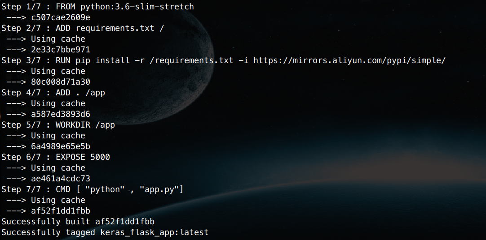
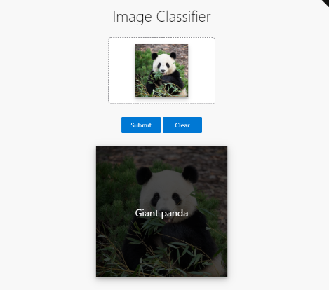
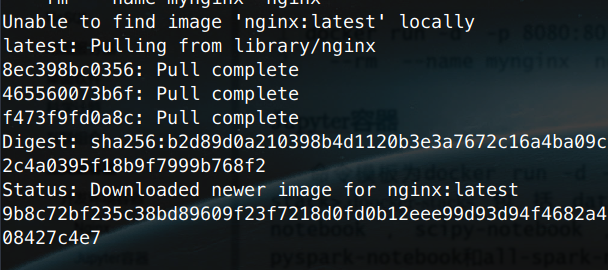

# 初学AI的你也能一键部署模型服务？奥利给！！

很多朋友可能已经是业界的老手了，但也有朋友可能刚开始接触和学习，一些环境配置可能还都没习惯，更不用说部署模型服务这个工程的大问题了。有没有什么办法和工具能帮助大家在这个过程感觉舒适的部署模型呢？答案是有的！本期文章为大家介绍一个当下容器技术的代表——Docker。文章会首先介绍Docker的概念，Docker的基本语法和用法，以及和Docker相关的几个工具的介绍。

## Docker是什么

###  容器与Docker

Docker是一种常用的容器化技术。这里的容器化和虚拟化是对应的概念，即Docker和VirtualBox等等虚拟机的效果有类似之处，但容器是更轻量化的一套隔离环境，不会额外虚拟硬件，很多资源和进程都是由宿主机直接执行，因此省了很多资源消耗，速度要比虚拟机快很多，特别适合机器学习等AI之类的计算密集型的程序隔离需求。

> Docker的容器概念与Spring Boot的容器概念完全不同，后者是指Java代码的一种组织形式。这两种不同容器都与微服务有关。

### 为什么学Docker

首先给大家举个很常见的情景。某公司新人小王去办公室报道，公司老鸟老李吩咐小王先去把工作用到的开发环境部署好再叫他。但是小王是个萌新程序员，下载这些开发库的地址都不知道。冗长的环境安装手册看的小王头昏脑涨，更不用说里面还有些错误和没写清楚的细节。这个场景是不是很多公司都经常在上演？其实，我在很久之前就不停的想，都程序员了为什么还要看技术手册自己安装，难道就没有一个可靠的技术帮我一键部署好吗 ?

答案是，当然有！你差的就是Docker！有了他，小王只需要下载好前辈写好的`Dockerfile`，只要网络OK，就可以一键运行演示程序。有没有很简单？下面我就来拿一个Github项目来告诉你怎么样做到。

## Docker部署实例

下面先来看如何部署一个最简单的图片分类服务的Demo程序，要求图片分类模型用深度学习框架`Keras`来实现，并通过`flask`发布模型的预测功能。下面我们就来看在Docker下的一键部署的过程。

首先，我们需要从Github上clone一份代码，进入这个文件夹。

```
git clone https://github.com/mtobeiyf/keras-flask-deploy-webapp.git
cd keras-flask-deploy-webapp
```

在进入到这个文件夹后，我们不妨看一下都有什么文件：

```
ls
app.py      LICENSE  README.md         static     util.py
Dockerfile  models   requirements.txt  templates
```

经过之前的学习，我们可以了解`requirements.txt`中管理了项目依赖。其他的文件中，`Dockerfile`是本次文章最核心的一个文件，有了他Docker才能在本地进行镜像的构建。这里我们可以把Dockerfile中的`RUN pip install`一行替换为`RUN pip install -r /requirements.txt -i https://mirrors.aliyun.com/pypi/simple/`，通过国内镜像来加速安装过程。我们可以输入下面的指令，自己构建一个测试镜像：

```
docker build -t keras_flask_test .
```

`docker build`就是Docker容器的镜像构建命令。这条命令执行后，会需要等待一段时间（主要是下载和安装，时间取决于机器配置和网络环境情况）。如下图所示，在这个项目的`dockerfile`里定义了7步构建。我这里因为提前构建了一次，这次构建会直接从缓存中读取，所以省略了耗时的部分。



只要看到上图最后的`Successfully built  XXX`和`Successfully tagged XXX`就说明已经构建成功。 `docker build`命令的作用是让Docker根据当前文件夹的`Dockerfile`内容，自动去构建名叫`keras_flask_test`的镜像。我们可以来确认下是否有这个镜像：

```
docker images   |grep -i keras  
keras_flask_test                                                 latest                  af52f1dd1fbb        1 days ago          917MB
```

`docker images`是显示出当前系统中存在的所有镜像，后续加`grep`来搜索指定关键词的镜像。这里因为正好之前构建了下，所以是一天前的。读者朋友如果刚刚构建好，镜像的创建时间应该是最近。有了镜像，我们就可以实际运行这个模型服务了：

```
docker run -it --rm -p 5000:5000 keras_flask_test
```

这里，`docker run`就是Docker从镜像产生一个容器了。因为Keras自动调用了tensorflow，运行后的命令会显示tensorflow的信息。同时，Keras也会自动下载一个mobilenetv2的轻量模型。等到一切就绪后，会提示`Model loaded. Check http://127.0.0.1:5000/`的信息。到这里，模型部署就已经完成了，是不是很6的感觉。我们的模型服务地址就是本机，端口号是`5000`

> Docker镜像与Docker容器的关系如同程序与进程一样，镜像是静态的基础，而容器是动态的实例。

这时候在浏览器中，打开`http://127.0.0.1:5000`应该能看到下图的界面了。我们可以往中间的地方上传一张图片，模型会返回当前图片的类别。大家可以玩玩，不过不要太为难这个小模型了。



## Docker常用命令

上面的例子很简单，我们回头总结和扩展相关的知识。先总结下Docker容器化的普遍的流程。

### Docker化程序的一般流程

对于使用者，在得到Docker化程序的代码后，首先，通过`docker build`找到`Dockerfile`构建镜像。然后，`docker run`从镜像产生一个容器的实例。

而对于开发者，一般在AI模型的Docker化之前，先由开发者在自己的非容器环境中开发调试好后才开始。然后开发者把自己环境的安装配置过程，完整的移植到`Dockerfile`中。一般来说，`Dockerfile`中的命令要能复现自己的整个配置过程，才算真正完整的Docker化程序开发。开发者一般需要自己重复使用者的步骤，以确保整个过程是真正能在新环境中重现。

简单来说，顺序是：编写Dockerfile→build→run三部曲。下面介绍这个流程相关的命令。由于Dockerfile的内容相对较多，所以暂时放在后面来说。我们先从build开始。

### 构建镜像

构建Docker镜像的命令是`docker build`，这条命令的基础是`Dockerfile`文件。命令的形式为：

```
docker build [OPTIONS] PATH | URL | -
```

其中，具体的选项有很多，建议参考帮助来学习（`docker build --help`）。我们着重介绍一些最常见的：

|      作用      | 参数          | 备注                                                         |
| :------------: | :------------ | ------------------------------------------------------------ |
|    名称标记    | `-t`          | 格式为` -t xxx/yyy:zzz`。`xxx`，`yyy`和`zzz`分别是用户名，镜像名和标签（版本） |
| Dockerfile位置 | `-f`          | 如果Dockerfile不在当前目录，或者需要构建的源文件文件名不是Dockerfile，则需要指定目标文件。 |
|    环境变量    | `--build-arg` | 构建时需要的环境变量。例如设置代理解决构建时的网络问题：`--build-arg http_proxy=http://xxx:port` |

一个简单的命令实例是：

```
docker build -t test .
```

这条命令就是根据当前目录的Dockerfile内容构建名为`test`的镜像，命令中最后的`.`表示构建的目录路径。

### 运行容器

运行Docker容器的命令是`docker run`，这条命令的基础是引用的镜像必须已经构建好。Docker也为运行命令准备了非常多的选项，具体可以参考帮助（`docker run --help`），这里先列出一部分比较常用的选项：

| 作用     | 参数     | 备注                                                         |
| :------- | :------: | :----------------------------------------------------------- |
| 命名     | `--name` | 为容器显式的起一个名字                                       |
| 交互终端 | `-it`    | 该选项是由`-i`和`-t`共同组成，有了这个选项容器才能通过docker命令直接连接终端操作。 |
| 挂载卷   | `-v`     | 很类似Linux中的挂载。主要作用是把主机的目录或文件映射为容器中的目录或文件，这样可以保存容器中修改的文件。 |
| 端口映射 |   `-p`        | 类似端口转发功能。可以避免容器端口与主机端口冲突的问题                           |
| 自动删除 |   `--rm`    | 运行完删除容器，特别适合只是临时调用一下的功能 |
| 自动启动 | `--restart` | 设置`--restart=always`让容器可在Docker重启后自动启动，类似于程序开机自启动。 |
| 环境变量 | `-e` | 容器运行时的环境变量，经常用户名密码等信息，例如`-e MYSQL_ROOT_PASSWORD=067116`  |
| 用户模式| `--user` | 设置容器读写使用的用户ID和组ID，通常设置`--user $UID:$GID`，可以让文件在容器读写后保持主机用户文件权限 |
| 后台模式| `-d` | 默认容器启动后，命令行直接会关联到当前命令行显示。该参数可以脱离命令行，使Docker容器运行在后台 |

> 善用`docker run`可以通过Docker快速实现很多功能，文后会给出具体的例子。

镜像构建可以通过上一步的`docker build`，自己来完成本地的构建。大多情况下，也可以直接使用别人构建好并上传到Dockerhub等Docker镜像托管网站的镜像。例如下面一条命令：

```
docker run -d  -p 8080:80 --rm  --name mynginx  nginx
```

这条命令是后台运行一个名为`mynginx`的`nginx`服务，把容器中的`80`端口映射为主机的`8080`，容器在停止时会自动删除。假设当前系统没有运行过这条命令，Docker会显示出以下信息：



第一条信息表示Docker没有找到本地的`nginx;latest`镜像；第二条信息显示从`library/nginx`上拉取最新的镜像。后面都是镜像拉取的分层进度，最后一行表示容器运行成功后返回的容器ID。

从这里，我们可以发现`docker run`的逻辑先搜索本地是否有构建过这个镜像，找不到时会从远端服务器中的仓库拉取最新镜像回来。这个过程非常类似Github上拉取代码，也可以看作一种分布式。

### 编写Dockerfile

Dockerfile为镜像构建提供了具体步骤，我们来看下今天介绍的项目中的Dockerfile内容：

```
FROM python:3.6-slim-stretch

ADD requirements.txt /
RUN pip install -r /requirements.txt -i https://mirrors.aliyun.com/pypi/simple/

ADD . /app
WORKDIR /app

EXPOSE 5000
CMD [ "python" , "app.py"]
```

其中，第一行的`FROM python:3.6-slim-stretch`中的`FROM`定义了基础镜像，这句表示该镜像基于`python:3.6-slim-stretch`构建，新镜像会包含基础镜像的所有文件。后面的`EXPOSE`表示镜像的容器对外暴露什么端口，这与`docker run -p xxxx:yyyy`中的`yyyy`对应。`CMD`表示镜像的容器运行后，自动执行的一条命令，类似于容器的入口命令。而剩下中间的许多行，则是构建镜像中需要的具体指令。在Dockerfile中，常用的指令有：
| 作用     |   指令    | 备注                                                         |
| -------- | :-------: | :----------------------------------------------------------- |
| 添加文件 |   `ADD`   | 格式为`ADD 主机文件路径  容器文件路径`                       |
| 运行命令 |   `RUN`   | `RUN shell命令`                                              |
| 工作目录 | `WORKDIR` | 指定当前目录，类似与`cd`，合理运用可方便脚本编写。           |
| 环境变量 |   `ENV`   | 定义构建时环境变量，不能通过参数动态改变。                   |
| 命令参数 |   `ARG`   | 定义动态参数，类似于命令行参数。如，Dockerfile定义`ARG GS_VERSION=2.11.0`后，可用`docker build --build-arg GS_VERSION=xxx`动态修改参数值 |

## 把Docker和Git一起学

Docker与Git虽然一种是容器技术，一种是版本管理技术，但两者的API和架构组织都有及其相似的地方。这里把这两个不同类的技术放在一起进行比较和分析。

- 两者都是DevOps的重要工具。Git负责管理代码版本，而Docker负责管理开发环境。同时，这两个工具的API风格非常相近，都有用法与作用类似的`push`，`pull`和`commit`。
- 两者都有本地和远程的概念，因此都是分布式。Git有本地仓库和托管在远程服务器的远程仓库，而Docker也有本地镜像和远程托管的镜像。在本地和远程之间，本地上传更新远程都是`push`，而拉取最新远程到本地都是`pull`。而在本地，从本地活动状态（对于Docker就是容器，对于Git就是暂存区）提交到本地版本（对于Git就是本地仓库，对于Docker就是本地镜像）都是`commit`。两者都有标记版本号的`tag`。
- 两者都有一个最大的托管网站。Docker的镜像默认都托管在Dockerhub上，而Git的代码大部分都在Github。而很多软件中的都会预留一个Github专用的函数方便使用。无论是Dockerhub还是Github，都需要我们先注册账号，在进行本地和远程操作时，都需要用到账号登录。


## 其他

### Docker的国内镜像

在本系列介绍过的Python和Conda中都提到的国内镜像的设置，Docker也不例外。对于版本>1.10的Docker，可以建立或修改`/etc/docker/daemon.json`文件，并参考如下内容进行修改：

```
{

 "registry-mirrors": ["https://registry.docker-cn.com",

        "https://docker.mirrors.ustc.edu.cn",

        "http://hub-mirror.c.163.com"],

        "max-concurrent-downloads": 30,

        "runtimes": {

            "nvidia": {

                "path": "nvidia-container-runtime",

                "runtimeArgs": []
            }

        }
}
```

以上分别配置了三个常用的国内镜像源，可以大大改善从Dockerhub访问的速度。由于Docker原生支持Dockerhub镜像，这时的加速是不需要修改docker 命令。此外，由于Docker除了在Dockerhub上托管，还有谷歌镜像服务（gcr.io）和 *quay*.io这两个网站。这两个网站的镜像暂时不被原生支持，只能由用户显式的进行修改，例如需要拉取的镜像是`docker pull gcr.io/xxx/yyy:zzz`时，就可以替代为`docker pull gcr.mirrors.ustc.edu.cn/xxx/yyy:zzz`。如果需要拉取的镜像是`docker pull quay.io/xxx/yyy:zzz`，可以替代为`docker pull quay.mirrors.ustc.edu.cn/xxx/yyy:zzz`。

> gcr.io和 *quay*.io两个托管网站其实也很重要。kubeflow的镜像源就托管在gcr.io上；而tensorflow相关的镜像主要也托管在quay.io上。

### Docker的分层机制

Docker有一套相对特殊的分层机制。一个Docker镜像是由多个层组成，任何对内部的修改只在当前镜像层保存。而容器中的修改只在容器层保存，不会影响镜像（除非运行了`docker commit`）。基于分层的结构，有以下好处：

- **分层结构有利于层通用的资源**。构建时的缓存也是基于分层来组织，例如在运行`docker build`时，如果已经成功构建了3层，第4层因为编译或网络问题出错中断后，再重新构建时会自动读取前三层的缓存，省去了很多时间。同样拉取镜像时，如果本地已经存在前几层的镜像，可以省去拉取下载这些镜像的时间。

- **分层结构有利于解耦合，出现问题后可以各个层单独解决**。这种分层设计其实很像软件工程中的模块化的思想。例如，如果发现我的基础镜像少了某个软件，而正好有一个镜像弥补了这个问题，我们可以简单的替换基础镜像，剩下的部分全部不动，就直接构建自己镜像就可以。

但也注意一个问题，Docker的分层结构有一个非常重要的特点。当前层删除上一层建立的文件，并不能节省空间。类似于你只是逻辑上删除了文件，不能访问，但并没有释放空间。例如，下面的Dockerfile内容片断：

```
# Add the skype debian repo
RUN curl -sSL https://repo.skype.com/data/SKYPE-GPG-KEY | apt-key add -
RUN echo "deb [arch=amd64] https://repo.skype.com/deb stable main" > /etc/apt/sources.list.d/skype.list

RUN apt-get update && apt-get -y install \
	skypeforlinux \
	--no-install-recommends \
	&& rm -rf /var/lib/apt/lists/*
```

上面的Dockerfile片断，包含了3个`RUN`，因此是3个step，也就是3个层。前两个层分别是下载skype的GPG KEY并添加到系统，以及增加软件源信息。第三层在前两层更新文件的基础进行软件源的更新，并安装skype。安装后为了使得镜像空间尽量小一点，运行了`rm -rf /var/lib/apt/list/*`来释放掉前面更新占用的空间。这也是为什么我们基于一个基础镜像，要安装新软件通常需要先update下。

如果我们把最后一个`RUN`改成下面这样，会如何：

```
RUN apt-get update && apt-get -y install \
	skypeforlinux --no-install-recommends 
RUN rm -rf /var/lib/apt/lists/*
```

这里我们把`rm`这条命令单独放在一个新的`RUN`后运行。我们运行容器会发现，相关软件源list下的文件还是没有了，但这时的空间并没有小。因为，**实际想删除的文件是由上一个RUN产生的，当前层并不能真正删除掉上一层的文件，只能逻辑上“视而不见”**。所以你现在可能就明白了，为什么真正工程用的Dockerfile，`RUN`后的命令都要用续行符连接成一条命令执行。

### 节省Docker镜像大小的办法  

上面的分层结构机制引出了一个Docker落地工程的重要问题：如何减小Docker镜像的体积。可能很多同学不够重视这个问题，我举几个例子就比较形象了。大家可能会经常用到Jupyter相关的镜像，而这些镜像动不动就几个G，甚至更大，我们单是下载就已经很慢了。如果我们还需要把镜像部署到云上，镜像上的大小会使得我们对更大的存储空间付出更多的费用，这时候可以说不必要的浪费是能省则省啊。

那如何节省Docker镜像大小？一种常见的方式就是上面所说的，对于只是**临时用到的文件一定要在本层删除干净**，不要留到下一层变成“钉子户”。但这种办法，会使得Dockerfile的编写格式变得非常臃肿，可读性非常差。如果涉及到文件拷贝等指令，镜像依然会产生很多额外层。我们可能会产生一种多个阶段构建的思想，就是先在外部自己构建一个用于打包编译的镜像，产生需要的结果文件后，拷贝到后面真正的镜像中，再继续构建。

下面看Docker官网举的例子（https://docs.docker.com/develop/develop-images/multistage-build/）：

我们先有一份`Dockerfile.build`,内容如下：

```
FROM golang:1.7.3
WORKDIR /go/src/github.com/alexellis/href-counter/
COPY app.go .
RUN go get -d -v golang.org/x/net/html \
  && CGO_ENABLED=0 GOOS=linux go build -a -installsuffix cgo -o app .
```

然后是真正需要的镜像`Dockerfile`：

```
FROM alpine:latest  
RUN apk --no-cache add ca-certificates
WORKDIR /root/
COPY app .
CMD ["./app"]  
```

在构建镜像时，通过脚本`build.sh`来实现多阶段构建逻辑：

```
#!/bin/sh
echo Building alexellis2/href-counter:build

docker build --build-arg https_proxy=$https_proxy --build-arg http_proxy=$http_proxy \  
    -t alexellis2/href-counter:build . -f Dockerfile.build

docker container create --name extract alexellis2/href-counter:build  
docker container cp extract:/go/src/github.com/alexellis/href-counter/app ./app  
docker container rm -f extract

echo Building alexellis2/href-counter:latest

docker build --no-cache -t alexellis2/href-counter:latest .
rm ./app
```

脚本先用`Dockerfile.build`构建到`app`，然后通过第二次构建中的`COPY`直接复制到最终的镜像里。但第一个镜像构建后，镜像文件和`app`如果不手动删除也会占用空间。同时我们需要维护两个Dockerfile，并编写更复杂的构建脚本，维护成本会高很多，后续出bug的机率会大大增加。

Docker后来新出了多阶段构建（multi-stage build）的新特性，来原生的支持这个功能。下面的原生多阶段构建的Dockerfile内容：

```
FROM golang:1.7.3 AS builder
WORKDIR /go/src/github.com/alexellis/href-counter/
RUN go get -d -v golang.org/x/net/html  
COPY app.go    .
RUN CGO_ENABLED=0 GOOS=linux go build -a -installsuffix cgo -o app .

FROM alpine:latest  
RUN apk --no-cache add ca-certificates
WORKDIR /root/
COPY --from=builder /go/src/github.com/alexellis/href-counter/app .
CMD ["./app"]  
```

可以看到，这个Dockerfile几乎是把之前两个文件合并在一起，而我们进行构建的命令从一个十多行的脚本，精简到下面一条命令就搞定了：

```
docker build -t alexellis2/href-counter:latest .
```

是不是很神奇，这个多阶段构建的原理就是把前半部分的构建，当成一个stage，并起名叫做`builder`。后面的实际镜像会直接从`builder`中拷贝需要的内容到新的镜像stage，所有中间文件都不会保存到最终的镜像中，也不会拷贝到本地系统的磁盘上。

其实，还有一种更节省镜像大小空间的方法，甚至能把一般几个G的镜像变成几百兆大小。大家有没有注意构建镜像时的`FROM alpine:latest `，这里用的`alpine`基础镜像就是减小大小的终极武器。简单来说，用`alpine`替换所有Ubuntu或者Debian、CentOS等等系统的基础镜像再构建，会大大减少空间占用。但这里的坑比较深，一般人不一定能搞定很多库的编译问题。

> 给大家一个自测题检验下你是否有apline编译所需的背景知识：你能否分得清glibc、glib、libc 和 musl/libc？

### 常用Docker容器工具

Docker在手，一切我有。善用Docker就会发现，环境搭建不是事。容器与宿主机进行互通操作的方式主要有以下三种：

- 大部分容器通过端口转发，浏览器的方式访问容器程序。
- 还可以通过命令行方式，调用容器环境中的特定命令。
- GUI程序可以通过图形转发方式进行操作。

下面会大家列举一些我个人常用到的一些容器工具的命令模板。

- Jupyter容器
  Jupyter容器是最常用的Python容器环境，主要得益于Jupyter强大功能，通过浏览器能方便的访问容器服务。

  Jupyter容器的命令模板为`docker run -d -P jupyter/<your desired stack>`。这里的`<your desired stack>`包括`datascience-notebook`，`r-notebook`，`scipy-notebook`，`tensorflow-notebook`，`pyspark-notebook`和`all-spark-notebook`，基本上覆盖大部分Jupyter notebook的环境需求了。以`datascience-notebook`为例：

  ```
  docker run -it --rm -p 8888:8888  \
  -v $PWD/:/home/jovyan/work  jupyter/datascience-notebook
  ```
  
- Rstudio容器

  类似Jupyter，R最流行的Rstudio也有基于浏览器的版本Rstudio Server，因此被制作成容器镜像也非常自然。同样，Rstudio容器镜像也有不同模板，如`geospatial`，`ropensci`等。下面以常用的标准镜像为例：

  ```
  docker run -P -d -p 8787:8787  \
  -v $PWD:/home/$USER/foo -e USERID=$UID -e USER=$USER  \
  -e PASSWORD=pass rocker/rstudio
  ```
  
- mysql容器

  数据库也可以使用容器，但一般需要通过挂载卷实现持久化存储。

  ```
  docker run --name test-mysql -p 3306:3306   \
  -v $PWD/mysql:/var/lib/mysql  -e MYSQL_ROOT_PASSWORD=067116  \
  -e MYSQL_DATABASE=gaode  -d mysql
  ```

- nodejs容器

  有很多项目需要使用`npm`构建，可以用Docker容器临时进行编译：

  ```
  docker run -it --rm --user $UID:$GID -p 4001:9966  \
  -v $PWD/:/mynode -w /mynode node /bin/sh -c  "npm install --registry http://registry.cnpmjs.org ;npm start"
  ```

- Maven容器

  同样，容器可以帮你解决运行`mvn install`的环境问题。

  ```
  docker run -it --rm --name my-maven-project  \
  -v $PWD:/usr/src/mymaven -w /usr/src/mymaven maven:3.2-jdk-7 mvn clean install
  ```

- Python容器

  可以直接用容器Python运行`py`脚本。

  ```
  docker run -it --rm --name my-running-script  \
  -v "$PWD":/usr/src/myapp -w /usr/src/myapp python:3 python your-daemon-or-script.py
  ```


最后，简单回顾这次文章内容。本次我们简单介绍了Docker，并从一个基于Docker部署的图像分类演示程序的使用上，感受了Docker部署环境的便利。然后，我们对Docker开发的流程三个步骤做了简单的介绍，并把Docker和Git放在以前比较了一下。最后，文章对镜像配置，分层机制，减小镜像大小和常用的容器工具四个方面一一进行了介绍。

文章的内容其实还是偏基础，并且因为篇幅有限制，无法做到面面俱到。关于Docker的资料和相关文章其实已经是非常多了，官网资料也很详细，本文主要从一个和其他文章有所区别的角度来试图为刚刚接触的朋友引路，关于具体的命令的所有选项还要查阅相关参考资料。在下次文章中，我们会对深度学习相关的Docker知识进行介绍。

## 参考资料

1.  [演示用程序源码](https://github.com/mtobeiyf/keras-flask-deploy-webapp.git)
   
2. [多阶段构建官网介绍](https://docs.docker.com/develop/develop-images/multistage-build/)
```

```